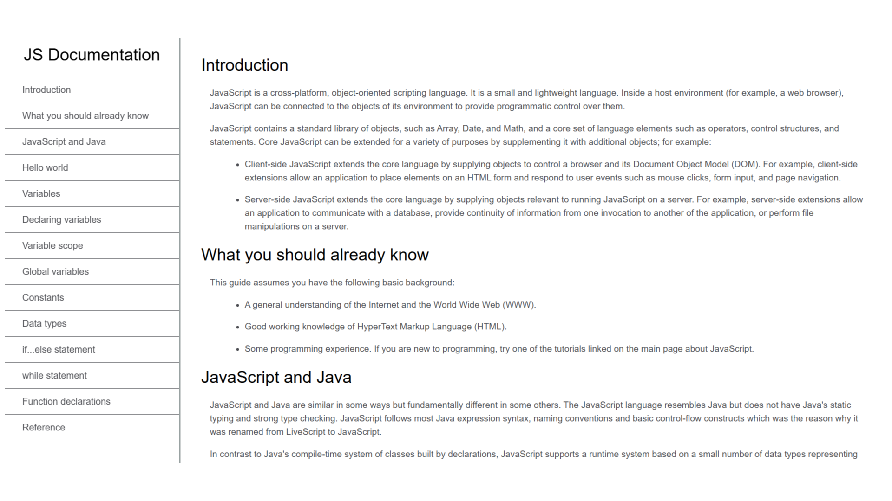

# JavaScript Documentation Page - FreeCodeCamp Project

## 📋 Project Overview

**JavaScript Documentation Page** is a learning project built in 2022 as part of the FreeCodeCamp Responsive Web Design Certification curriculum. This project focuses on creating a technical documentation page with a specific multi-column layout, implementing a fixed sidebar navigation system that remains accessible while scrolling through content.

**Live Demo:** [https://alaa-younsi.github.io/JS-Documentation/](https://alaa-younsi.github.io/JS-Documentation/)

---

## 🎯 Project Purpose

This project was created specifically to:
- **Fulfill FreeCodeCamp certification requirements** for the Responsive Web Design curriculum
- **Practice implementing a technical documentation layout** with specific structural constraints
- **Master CSS positioning techniques** for creating a fixed sidebar navigation system
- **Build responsive layouts** that adapt to different screen sizes while maintaining functionality
- **Apply semantic HTML** to structure technical content appropriately

---

## 🛠️ Technology Stack

### Core Technologies
- **HTML5** - Semantic structure with proper sectioning elements
- **CSS3** - Advanced layout techniques, positioning, and responsive design
- **Pure implementation** - No frameworks, libraries, or JavaScript for layout

### FreeCodeCamp Requirements
This project had to meet specific user stories:
1. Fixed navigation sidebar with documentation topics
2. Main content area that scrolls independently
3. Responsive design that adapts to mobile devices
4. Proper semantic HTML structure
5. Passing all test suite requirements

---

## ✨ Key Features & Implementation

### Layout Architecture
- **Fixed Sidebar Navigation**: Left-aligned menu that remains visible during scrolling
- **Main Content Area**: Scrollable section containing all documentation content
- **Responsive Design**: Layout adapts for mobile with collapsible navigation
- **Proper Z-index Management**: Ensuring correct layering of fixed elements

### Technical Implementation
- **CSS Positioning**: Mastery of `position: fixed` for sidebar
- **Scroll Management**: Independent scrolling regions
- **Media Queries**: Breakpoints for different device sizes
- **Semantic HTML**: Use of `<nav>`, `<main>`, `<section>`, `<article>` elements

### Content Organization
- **Hierarchical Structure**: Nested documentation sections
- **Internal Linking**: Anchor links connecting sidebar to content sections
- **Code Examples**: Formatted JavaScript code snippets
- **Clean Typography**: Readable technical documentation styling

---

## 🎓 Learning Context

### FreeCodeCamp Curriculum Position
This project was part of the **Responsive Web Design Certification** and specifically tested:
- Complex layout implementation without frameworks
- Fixed positioning techniques
- Responsive navigation patterns
- Technical content presentation skills

### Skill Development Focus
- **CSS Layout Mastery**: Moving beyond basic box model to complex positioning
- **Responsive Patterns**: Implementing mobile-first responsive design
- **Project Structure**: Organizing larger projects with clear separation of concerns
- **Testing Compliance**: Meeting specific technical requirements and passing test suites

---

## 🔄 Relationship to Other Projects

This documentation page represented:
- **Intermediate CSS Practice**: Between basic projects and full portfolio work
- **Layout Pattern Learning**: A specific technical skill applied later in portfolio designs
- **Certification Progress**: Another step toward FreeCodeCamp certification completion
- **Foundation Building**: Preparation for more complex multi-column layouts in future work

---

## 📈 Skills Demonstrated

### Technical Skills
- **Advanced CSS Positioning**: Fixed, relative, and absolute positioning
- **Responsive Design Implementation**: Media queries and adaptive layouts
- **Semantic HTML Structure**: Proper document outline and accessibility
- **Cross-Browser Compatibility**: Consistent rendering across browsers

### Professional Skills
- **Requirement Interpretation**: Translating user stories to implementation
- **Project Specification Compliance**: Meeting exact certification requirements
- **Technical Documentation**: Presenting complex information clearly
- **Problem Decomposition**: Breaking layout challenges into solvable parts

---

## 📄 Certification Context

Successfully completed as part of FreeCodeCamp's **Responsive Web Design Certification**, demonstrating proficiency in:
- Complex CSS layouts without frameworks
- Fixed navigation implementations
- Responsive technical documentation
- Accessible web design principles

---

## 📄 License

This project is licensed under the MIT License - see the [LICENSE](LICENSE) file for details.

## 👤 Author Note

**Alaa Younsi**  
*Web Development Learner - 2022*

This project represents structured learning through FreeCodeCamp's project-based curriculum, focusing on mastering specific layout techniques that would become foundational for more complex portfolio designs.

---

*This documentation page project showcases the value of targeted practice - mastering specific technical challenges through guided projects that build toward comprehensive skill development.*
